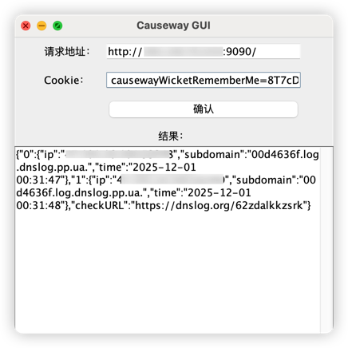

# Apache Causeway 反序列化远程代码执行漏洞验证工具（CVE-2025-64408）
## 简介
Apache Causeway 是 Apache 基金会开源的 Java 企业级领域建模框架，基于 Spring Boot 架构，能够为实体类、领域服务和 ViewModel 自动生成 Web 界面与 API 接口，广泛应用于企业级管理系统的构建。
## 漏洞描述
在受影响的版本中，框架在处理 ViewModel 的书签（bookmark）与 URL 片段时存在严重的安全缺陷：**系统将客户端可控的内容直接作为对象状态进行反序列化，且缺乏完整性校验机制**。这使得经过身份认证的攻击者能够构造恶意的 URL 片段，当服务端尝试还原 ViewModel 时触发反序列化操作，在存在可利用 gadget 链的环境下实现远程代码执行。
## 漏洞修复
Apache Causeway 已经发布了修复该漏洞的版本，建议用户尽快升级到3.5.0版本以上，以防止攻击者利用该漏洞。
## 使用方法
使用方法如下：
- 输入Causeway平台请求地址
- 输入Cookie,点击确认查看DNSLOG平台的返回结果，若不存在则返回{"null":"null"}

## 编译版本
- JDK 17

## 免责声明
本工具仅用于安全研究和防御测试，请勿用于非法用途。使用者应对自己的行为负责，开发者不承担任何责任。